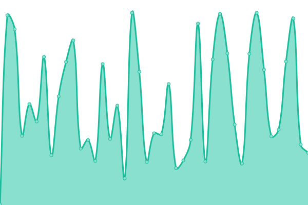

# 📈 [Live Status](https://status.skyfallmc.cc): <!--live status--> **🟩 All systems operational**

This repository contains [Upptime](https://github.com/upptime/upptime), a free and open uptime monitor and status page for [SkyfallMC](https://play.skyfallmc.cc/).

<!--start: status pages-->
<!-- This summary is generated by Upptime (https://github.com/upptime/upptime) -->
<!-- Do not edit this manually, your changes will be overwritten -->
<!-- prettier-ignore -->
| URL | Status | History | Response Time | Uptime |
| --- | ------ | ------- | ------------- | ------ |
|  [Main Website](https://play.skyfallmc.cc) | 🟩 Up | [main-website.yml](https://github.com/ethanchey/skyfallmc-server-status/commits/HEAD/history/main-website.yml) | 

 166ms
     
 | 

<a href="https://status.skyfallmc.cc/history/main-website">100.00%</a>
    

|  [Files Website](https://files.skyfallmc.cc) | 🟩 Up | [files-website.yml](https://github.com/ethanchey/skyfallmc-server-status/commits/HEAD/history/files-website.yml) | 

 160ms
     
 | 

<a href="https://status.skyfallmc.cc/history/files-website">100.00%</a>
    

|  [SkyfallSMP Map](https://map.skyfallmc.cc) | 🟩 Up | [skyfall-smp-map.yml](https://github.com/ethanchey/skyfallmc-server-status/commits/HEAD/history/skyfall-smp-map.yml) | 

 211ms
     
 | 

<a href="https://status.skyfallmc.cc/history/skyfall-smp-map">100.00%</a>
    

|  [Server Statistics](https://stats.skyfallmc.cc) | 🟩 Up | [server-statistics.yml](https://github.com/ethanchey/skyfallmc-server-status/commits/HEAD/history/server-statistics.yml) | 

 243ms
     
 | 

<a href="https://status.skyfallmc.cc/history/server-statistics">100.00%</a>
    

|  [SkyfallMC Minecraft Server](play.skyfallmc.cc) | 🟩 Up | [skyfall-mc-minecraft-server.yml](https://github.com/ethanchey/skyfallmc-server-status/commits/HEAD/history/skyfall-mc-minecraft-server.yml) | 

 32ms
     
 | 

<a href="https://status.skyfallmc.cc/history/skyfall-mc-minecraft-server">100.00%</a>
    

<!--end: status pages-->

📈 [**Visit our status website →**](https://status.skyfallmc.cc)

**Note:** Response times, graphs, and this file are updated around every 4 hours. Server statuses are updated as quickly as possible but is limited due to GitHub Actions not running on time.

## 📄 License

- Powered by: [Upptime](https://github.com/upptime/upptime)
- Code: [MIT](./LICENSE) © [merge1973](https://status.skyfallmc.cc)
- Data in the `./history` directory: [Open Database License](https://opendatacommons.org/licenses/odbl/1-0/)
